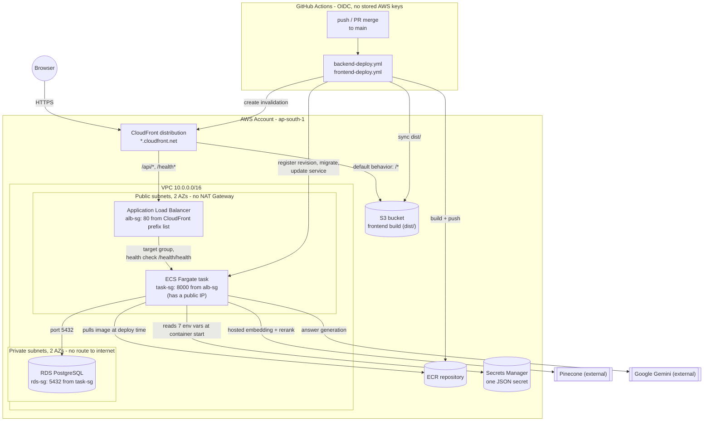

# AWS Deployment Runbook

This is a record of the actual, working deployment of this application to AWS — every
resource that exists, in the order that lets you rebuild the whole thing from an empty AWS
account without hitting the dead ends this session hit along the way. It replaces an earlier,
purely hypothetical version of this file: everything below was actually created, clicked
through, and verified against the live stack.

**All resource names below use the prefix `medical-student-assistant` and region `ap-south-1`
(Mumbai)** — the actual values from this deployment. If you're rebuilding this in a different
AWS account, the names/prefix are yours to choose, but keep them consistent across every
resource that references another one by name (task definitions, security group rules,
IAM trust policies) — that's most of what makes this reproducible.

**Ordering note:** the phases below are arranged in the order that avoids rework — in
particular, the load balancer and CloudFront are built *before* the ECS task definition, so the
task definition's `CORS_ORIGINS` value can be set correctly the first time instead of started
as a placeholder and fixed in a second revision (which is what actually happened live — see
the Troubleshooting section for that story and a couple of others worth knowing before you
hit them yourself).

---

## High-Level Architecture



**How a request actually flows**, end to end:

1. A browser loads `https://<distribution>.cloudfront.net/` → CloudFront's default cache
   behavior serves `index.html` and the JS/CSS bundle from the **S3 bucket**.
2. The React app calls `/api/...` and `/health/...` (relative URLs) → CloudFront's other two
   cache behaviors match those paths and forward the request to the **ALB** instead of S3 —
   this is what keeps the frontend and API on one origin, which matters because the refresh
   token cookie is `SameSite=Lax` and would never arrive on a genuinely cross-origin call.
3. The ALB forwards to whichever **ECS Fargate task** is registered and healthy in its target
   group.
4. The task was started with an image pulled from **ECR**, and its environment was populated
   at container start from one JSON secret in **Secrets Manager** (7 keys: Pinecone, Gemini,
   the database URL, the JWT signing key, and the seeded admin's email/password).
5. The task talks to **RDS** (private subnets, no internet route at all) for everything
   user/conversation/document related, and to **Pinecone**/**Gemini** directly over the
   internet (it has a public IP because there's no NAT Gateway — see Phase 1).
6. On every push to `main`, **GitHub Actions** authenticates to AWS via **OIDC** (no access
   keys stored anywhere) and re-runs steps 3–5's infrastructure: build & push a new image,
   register a new task definition revision, migrate the database against that exact revision,
   and only then update the live service — or sync a new frontend build to S3 and invalidate
   CloudFront's cache.

---

## Resource Inventory

Everything that exists today, for quick reference while working through the phases below or
while debugging later.

| Resource | Value |
|---|---|
| AWS Account ID | `519035820911` |
| Region | `ap-south-1` |
| VPC | `vpc-003d68cb143d4995c` (`10.0.0.0/16`) |
| Public subnet (AZ `ap-south-1a`) | `subnet-0d7efb05e950dd1ea` (`10.0.0.0/24`) |
| Public subnet (AZ `ap-south-1b`) | `subnet-0a88cfa518fe7b774` (`10.0.1.0/24`) |
| Private subnet (AZ `ap-south-1a`) | `subnet-0d8b962056dfb3f55` (`10.0.10.0/24`) |
| Private subnet (AZ `ap-south-1b`) | `subnet-0e3297d9a0dc8ba23` (`10.0.11.0/24`) |
| `alb-sg` | `sg-029dcd6a9ce20af19` |
| `task-sg` | `sg-08dc9e7b00a8940b8` |
| `rds-sg` | `sg-063aff38f31e81624` |
| RDS instance | `medical-student-assistant-db` |
| RDS endpoint | `medical-student-assistant-db.c3ugy24cq1u0.ap-south-1.rds.amazonaws.com` |
| RDS database name | `medical_assistant` |
| ECR repository | `519035820911.dkr.ecr.ap-south-1.amazonaws.com/medical-student-assistant-backend` |
| Secrets Manager secret | `medical-student-assistant/backend` (ARN suffix `-q62Rkn`) |
| CloudWatch log group | `/ecs/medical-student-assistant-backend` |
| ECS cluster | `medical-student-assistant-cluster` |
| ECS task definition family | `medical-student-assistant-backend` |
| ECS service | `medical-student-assistant-service` |
| Target group | `medical-student-assistant-tg` |
| ALB | `medical-student-assistant-alb`, DNS `medical-student-assistant-alb-1573882333.ap-south-1.elb.amazonaws.com` |
| S3 bucket (frontend) | `medical-student-assistant-frontend-519035820911` |
| CloudFront distribution | domain `d1u7p8d1507l08.cloudfront.net`, ARN `.../distribution/E39FPVC302KYZF` |
| Task execution role | `medical-student-assistant-task-execution-role` |
| Task role | `medical-student-assistant-task-role` |
| Personal CLI IAM user | `medical-student-assistant-cli` (manual `docker push`, S3 sync) |
| GitHub Actions IAM role | `medical-student-assistant-github-actions` (OIDC, no stored keys) |
| GitHub repo | `Nithusikan01/Medical-Student-Assistant` |

## Prerequisites

- An AWS account with billing set up. Consider a billing budget alert (**Budgets** console,
  a zero-spend or fixed-amount budget with an email alert) before creating anything — RDS and
  the ALB are the two genuinely fixed-cost items here (see Cost Summary at the end).
- **Docker Desktop** installed and running locally (for building/pushing the backend image
  manually, and for the one-time verification build).
- **AWS CLI v2** installed. Run `aws configure` with an IAM user's access key/secret once you
  create one (Phase 4 covers the personal CLI user this deployment used).
- **GitHub CLI (`gh`)**, authenticated (`gh auth login`), if you want to drive PRs/branch
  protection from the terminal the way this session did. Not required — everything it does has
  a Console/web UI equivalent.
- **Node.js 18+** locally, to build the frontend before uploading it to S3.

---

## Phase 1: Networking

**Goal:** one VPC, two public subnets (ALB + backend task) and two private subnets (RDS),
across two Availability Zones, with **no NAT Gateway** — the backend task gets a public IP of
its own instead (it's already in a public subnet), and RDS needs no outbound internet access at
all, so paying ~$32–35/month for a NAT Gateway buys nothing here.

### 1.1 VPC and subnets

1. **VPC console** → **Create VPC** → **VPC and more** (not "VPC only" — this wizard also
   creates subnets, route tables, and the Internet Gateway in one pass).
2. **Name tag auto-generation**: `medical-student-assistant`
3. **IPv4 CIDR block**: `10.0.0.0/16`, no IPv6, default tenancy.
4. **Availability Zones**: 2, explicitly `ap-south-1a` and `ap-south-1b`.
5. **Public subnets**: 2. **Private subnets**: 2. Customize the CIDR blocks to:
   - Public: `10.0.0.0/24` (AZ1), `10.0.1.0/24` (AZ2)
   - Private: `10.0.10.0/24` (AZ1), `10.0.11.0/24` (AZ2)
6. **NAT gateways**: **None**.
7. **VPC endpoints**: None. Leave DNS hostnames/resolution enabled (default).
8. **Create VPC**.

This also creates one shared public route table (`0.0.0.0/0 → Internet Gateway`, associated
with both public subnets) and one private route table per private subnet, each containing
*only* the local `10.0.0.0/16` route — no path to the internet at all. That's the property
that matters: confirm it later by opening either private route table's **Routes** tab and
checking there's exactly one row.

### 1.2 Security groups

Create these **in this order** — each one after the first references the previous one as its
traffic source, so it has to exist first.

**`alb-sg`** — EC2 console → Security Groups → Create:
- VPC: the one above.
- Inbound rule: Type HTTP, **Source: a Prefix List**, specifically
  `com.amazonaws.global.cloudfront.origin-facing` — not `0.0.0.0/0`. This is what forces all
  traffic through CloudFront rather than allowing anyone to hit the ALB directly and bypass the
  same-origin cookie design.
- No HTTPS/443 rule needed — CloudFront terminates TLS at the edge and talks to the ALB over
  plain HTTP internally.

**`task-sg`**:
- Inbound rule: Type Custom TCP, port `8000`, **Source: the `alb-sg` security group** (not an
  IP range).

**`rds-sg`**:
- Inbound rule: Type PostgreSQL (port 5432), **Source: the `task-sg` security group**.

---

## Phase 2: Database (RDS)

1. **RDS console** → **Subnet groups** → **Create DB subnet group**: both **private** subnets
   selected (not the public ones), both AZs checked.
2. **RDS console** → **Create database** → **Standard create** (not "Easy create" — need
   manual control over VPC/subnet/security group).
3. Engine: PostgreSQL, default version. Template: **Free tier** if offered, else Dev/Test.
4. **Master username**: `postgres`. **Credentials management**: Self managed.

   **Type your own master password instead of using "Auto generate a password."** This
   deployment's first attempt used auto-generate, a connection drop mid-request corrupted that
   flow, and every retry failed with a generic *"Fail to request credentials"* error until
   switching to a manually-typed password. Copy it somewhere safe before continuing regardless.
5. **Instance class**: `db.t4g.micro`. Storage: default (20 GiB).
6. **Connectivity**: "Don't connect to an EC2 compute resource"; VPC = the one above; **DB
   subnet group** = the one from step 1; **Public access: No**; security group = `rds-sg`.
7. **Additional configuration** (expand it, easy to miss): **Initial database name**:
   `medical_assistant` — set this explicitly, a blank value leaves no named database for the
   app to connect to. **Deletion protection**: leave unchecked for a dev/learning setup.
8. **Create database.** Takes 5–10 minutes. Once available, copy the **endpoint** from
   **Connectivity & security**.

---

## Phase 3: Container Registry

```
aws ecr create-repository --repository-name medical-student-assistant-backend \
  --region ap-south-1 --image-scanning-configuration scanOnPush=true
```

Or via Console: **ECR** → **Create repository** → Private → name as above → enable **Scan on
push**. Note the repository URI (`<account-id>.dkr.ecr.ap-south-1.amazonaws.com/<name>`).

---

## Phase 4: IAM Roles

Three distinct principals, each with a narrower job than the last — conflating them (e.g.
giving the CI pipeline the running container's permissions, or vice versa) is the kind of
mistake that's invisible until an audit or an incident.

### 4.1 ECS task execution role

What ECS itself uses to pull the image and read secrets on the container's behalf, before your
app code runs.

1. **IAM** → **Roles** → **Create role** → **AWS service** → **Elastic Container Service** →
   **Elastic Container Service Task** (sets the trust policy for `ecs-tasks.amazonaws.com`
   automatically).
2. Attach the AWS-managed policy **`AmazonECSTaskExecutionRolePolicy`** (covers ECR pulls +
   CloudWatch Logs writes).
3. Name it `medical-student-assistant-task-execution-role`.
4. Add an inline policy for Secrets Manager (not covered by the managed policy above):

```json
{
  "Version": "2012-10-17",
  "Statement": [
    {
      "Effect": "Allow",
      "Action": "secretsmanager:GetSecretValue",
      "Resource": "arn:aws:secretsmanager:ap-south-1:519035820911:secret:medical-student-assistant/*"
    }
  ]
}
```

### 4.2 ECS task role

What the *running container* itself could call via the AWS SDK. This app makes no AWS API
calls from inside the request path (Pinecone/Gemini are external HTTPS APIs), so this stays
empty — ECS still requires one to be set.

Same steps as 4.1 (AWS service → Elastic Container Service → Elastic Container Service Task),
attach **no permissions**, name it `medical-student-assistant-task-role`.

### 4.3 Personal CLI user (for manual `docker push` / `aws s3 sync`)

1. **IAM** → **Users** → **Create user**: `medical-student-assistant-cli`, no console access.
2. Attach **`AmazonEC2ContainerRegistryPowerUser`** (covers ECR push/pull).
3. **Security credentials** tab → **Create access key** → Use case: Command Line Interface →
   copy both values, then locally: `aws configure` (region `ap-south-1`).
4. Once the S3 bucket and CloudFront distribution exist (Phases 7–8), add this inline policy
   too, so `aws s3 sync` and cache invalidation work from your own terminal:

```json
{
  "Version": "2012-10-17",
  "Statement": [
    {
      "Effect": "Allow",
      "Action": ["s3:PutObject", "s3:DeleteObject", "s3:ListBucket"],
      "Resource": [
        "arn:aws:s3:::medical-student-assistant-frontend-519035820911",
        "arn:aws:s3:::medical-student-assistant-frontend-519035820911/*"
      ]
    },
    {
      "Effect": "Allow",
      "Action": "cloudfront:CreateInvalidation",
      "Resource": "arn:aws:cloudfront::519035820911:distribution/E39FPVC302KYZF"
    }
  ]
}
```

(The fourth principal, the GitHub Actions OIDC role, is created in Phase 12 — it isn't needed
until CI/CD, so it's covered there rather than here.)

---

## Phase 5: Secrets Manager

One JSON secret holding every credential the app needs, so the ECS task definition can
reference individual keys inside it (`<secret-arn>:KEY_NAME::`) rather than needing one secret
per variable.

1. **Secrets Manager** → **Store a new secret** → **Other type of secret**.
2. Add these key/value pairs (fill in real values yourself directly in the console — don't
   paste secrets into a chat or a doc):

   | Key | Value |
   |---|---|
   | `PINECONE_API_KEY` | your Pinecone key |
   | `PINECONE_INDEX_NAME` | your Pinecone index name |
   | `GEMINI_API_KEY` | your Gemini key |
   | `DATABASE_URL` | `postgresql+psycopg://postgres:<rds password>@<rds endpoint>:5432/medical_assistant` |
   | `SECRET_KEY` | a random 48-byte token — generate with `python -c "import secrets; print(secrets.token_urlsafe(48))"` |
   | `ADMIN_EMAIL` | the address for the first admin account |
   | `ADMIN_PASSWORD` | 12+ characters — the app refuses to seed the admin otherwise |

3. **Secret name**: `medical-student-assistant/backend` — this exact prefix is what the IAM
   policy in 4.1 is scoped to.
4. Disable automatic rotation, store it.
5. Copy the secret's **ARN** from its detail page — needed in Phase 10.

---

## Phase 6: Load Balancer

Built *before* the ECS task definition, deliberately — CloudFront (next phase) needs this ALB's
DNS name as an origin, and the task definition (Phase 10) needs to know CloudFront's real
domain for `CORS_ORIGINS`. Building in this order means that value is only ever written once.

### 6.1 Target group

1. **EC2** → **Target Groups** → **Create target group**.
2. **Target type: IP addresses** (required for Fargate's `awsvpc` networking — not
   "Instances").
3. Name `medical-student-assistant-tg`, Protocol HTTP, Port `8000`, same VPC.
4. **Health check path**: `/health/health` — the health router is mounted under `/health` and
   itself declares `/health`, so the full path really is `/health/health`.
5. Leave the "Register targets" page empty — the ECS service (Phase 11) registers targets
   automatically. **Create.**

### 6.2 Application Load Balancer

1. **EC2** → **Load Balancers** → **Create** → **Application Load Balancer**.
2. Name `medical-student-assistant-alb`, **Internet-facing**, IPv4.
3. Both **public** subnets, both AZs.
4. Security group: `alb-sg` (remove the default one).
5. Listener: HTTP, port 80, default action → forward to `medical-student-assistant-tg`.
6. **Create.** Wait for **Active**, then copy the **DNS name**.

---

## Phase 7: Frontend Hosting (S3)

1. **S3** → **Create bucket**: `medical-student-assistant-frontend-519035820911` (account ID
   suffix guarantees global uniqueness), region `ap-south-1`.
2. **Block all public access**: leave all four boxes checked — CloudFront reaches this bucket
   through Origin Access Control (OAC), never a public bucket policy.
3. Build the frontend locally and upload its output to the bucket **root** (not nested under a
   `dist/` folder):

   ```powershell
   cd frontend
   npm run build
   ```

   Upload the *contents* of `frontend/dist/` (`index.html` and `assets/`) — via Console
   drag-and-drop for a one-off, or `aws s3 sync dist/ s3://medical-student-assistant-frontend-519035820911 --delete`
   once the CLI user has the S3 permissions from Phase 4.3.

---

## Phase 8: CloudFront

This is what actually makes the deployment work as one coherent app: one CloudFront
distribution serves the static frontend *and* proxies API calls to the ALB, so the browser
only ever sees one origin — required because the refresh-token cookie is `SameSite=Lax` and
is never sent on a genuinely cross-site `fetch`.

### 8.1 Create the distribution (S3 origin)

The exact console flow may vary (a multi-step wizard: Get started → Specify origin → Enable
security → Review and create, in this deployment's case):

1. **Distribution name**: `medical-student-assistant`. **Distribution type**: **Single website
   configuration** (one frontend, not reused across domains). **Route 53 managed domain**:
   skip — using CloudFront's own `*.cloudfront.net` domain, no custom domain for now.
2. **Origin type**: Amazon S3 → **Browse S3** → select the bucket from Phase 7 (select the
   bucket itself, not a file/folder inside it). **Origin path**: blank.
3. **Allow private S3 bucket access to CloudFront**: keep **Recommended** selected — this one
   setting both creates an Origin Access Control *and* updates the bucket policy to allow it,
   in one step (older CloudFront consoles split this into two separate manual steps).
4. Origin/cache settings: **Use recommended settings** for both.
5. **Enable security protections**: **Do not enable** — AWS WAF costs a real amount
   (~$14/10M requests, plus a base monthly charge) that isn't justified here.
6. **Create distribution.** Note the **domain name** (e.g. `d1u7p8d1507l08.cloudfront.net`).

### 8.2 Verify the default root object

**General** tab → **Settings** → confirm **Default root object** is `index.html`. Set it if
blank.

### 8.3 SPA routing — custom error responses

This is a client-side-routed React app; a direct load of e.g. `/c/some-id` must still serve
`index.html` so React Router can take over, rather than S3 returning a 404 for a path that
isn't a real file.

**Error pages** tab → **Create custom error response**, twice:
- HTTP error code **403** → Customize: Yes → Response page path `/index.html` → Response code
  `200`
- HTTP error code **404** → same settings

### 8.4 Add the ALB as a second origin

**Origins** tab → **Create origin**:
- **Origin domain**: the ALB's DNS name from Phase 6.2
- **Protocol**: **HTTP only**, port 80 (the ALB listener is plain HTTP — CloudFront terminates
  HTTPS at the edge)

### 8.5 Add the two behaviors that route to the ALB

**Behaviors** tab → **Create behavior**, twice:

| Path pattern | Origin | Cache policy | Origin request policy |
|---|---|---|---|
| `/api/*` | the ALB origin | **CachingDisabled** | **AllViewerExceptHostHeader** |
| `/health*` | the ALB origin | **CachingDisabled** | **AllViewerExceptHostHeader** |

The origin request policy matters as much as the cache policy here — **AllViewerExceptHostHeader**
is what forwards cookies, the `Authorization` header, and query strings through to the ALB.
Without it, the refresh cookie and bearer token get silently dropped at the CDN layer and
nothing past login will work.

Wait for the distribution to move from **Deploying** to **Enabled** (5–15 minutes) before
testing.

---

## Phase 9: Build and Push the Backend Image

```powershell
cd "path\to\Medical-Student-Assistant"

# Token expires after 12h - re-run this if it's been a while
aws ecr get-login-password --region ap-south-1 | docker login --username AWS --password-stdin 519035820911.dkr.ecr.ap-south-1.amazonaws.com

# Build context is the repo root, not backend/ - the backend package imports the engine package
docker build -t medical-student-assistant-backend:latest -f Dockerfile .

docker tag medical-student-assistant-backend:latest 519035820911.dkr.ecr.ap-south-1.amazonaws.com/medical-student-assistant-backend:latest
docker push 519035820911.dkr.ecr.ap-south-1.amazonaws.com/medical-student-assistant-backend:latest
```

If a push gets interrupted partway (a dropped connection, etc.), just re-run `docker push` —
Docker pushes layer by layer and skips anything already present in the registry, so nothing
already uploaded is lost.

---

## Phase 10: ECS Cluster and Task Definition

### 10.1 Cluster

**ECS** → **Clusters** → **Create cluster** → name `medical-student-assistant-cluster` →
**AWS Fargate (serverless)** (no EC2 instances to manage).

### 10.2 CloudWatch log group

Create it manually rather than relying on the task to auto-create it — the execution role in
Phase 4.1 can *write* to an existing log group but was not given `logs:CreateLogGroup`:

**CloudWatch** → **Log groups** → **Create log group** → name `/ecs/medical-student-assistant-backend`.

### 10.3 Task definition

The most reliable way to create this is pasting raw JSON rather than filling in the form field
by field — **Task definitions** → **Create new task definition with JSON**. This is the exact
JSON this deployment uses (also checked into the repo at `backend/deploy/task-definition.json`,
which the CI workflow renders a new image tag into on every deploy):

```json
{
  "family": "medical-student-assistant-backend",
  "networkMode": "awsvpc",
  "requiresCompatibilities": ["FARGATE"],
  "cpu": "512",
  "memory": "1024",
  "executionRoleArn": "arn:aws:iam::519035820911:role/medical-student-assistant-task-execution-role",
  "taskRoleArn": "arn:aws:iam::519035820911:role/medical-student-assistant-task-role",
  "containerDefinitions": [
    {
      "name": "backend",
      "image": "519035820911.dkr.ecr.ap-south-1.amazonaws.com/medical-student-assistant-backend:latest",
      "essential": true,
      "portMappings": [
        { "containerPort": 8000, "protocol": "tcp" }
      ],
      "environment": [
        { "name": "COOKIE_SECURE", "value": "true" },
        { "name": "ALLOW_OPEN_REGISTRATION", "value": "true" },
        { "name": "CORS_ORIGINS", "value": "https://d1u7p8d1507l08.cloudfront.net" }
      ],
      "secrets": [
        { "name": "PINECONE_API_KEY", "valueFrom": "arn:aws:secretsmanager:ap-south-1:519035820911:secret:medical-student-assistant/backend-q62Rkn:PINECONE_API_KEY::" },
        { "name": "PINECONE_INDEX_NAME", "valueFrom": "arn:aws:secretsmanager:ap-south-1:519035820911:secret:medical-student-assistant/backend-q62Rkn:PINECONE_INDEX_NAME::" },
        { "name": "GEMINI_API_KEY", "valueFrom": "arn:aws:secretsmanager:ap-south-1:519035820911:secret:medical-student-assistant/backend-q62Rkn:GEMINI_API_KEY::" },
        { "name": "DATABASE_URL", "valueFrom": "arn:aws:secretsmanager:ap-south-1:519035820911:secret:medical-student-assistant/backend-q62Rkn:DATABASE_URL::" },
        { "name": "SECRET_KEY", "valueFrom": "arn:aws:secretsmanager:ap-south-1:519035820911:secret:medical-student-assistant/backend-q62Rkn:SECRET_KEY::" },
        { "name": "ADMIN_EMAIL", "valueFrom": "arn:aws:secretsmanager:ap-south-1:519035820911:secret:medical-student-assistant/backend-q62Rkn:ADMIN_EMAIL::" },
        { "name": "ADMIN_PASSWORD", "valueFrom": "arn:aws:secretsmanager:ap-south-1:519035820911:secret:medical-student-assistant/backend-q62Rkn:ADMIN_PASSWORD::" }
      ],
      "logConfiguration": {
        "logDriver": "awslogs",
        "options": {
          "awslogs-group": "/ecs/medical-student-assistant-backend",
          "awslogs-region": "ap-south-1",
          "awslogs-stream-prefix": "ecs"
        }
      }
    }
  ]
}
```

Because CloudFront already exists by this point (Phase 8), `CORS_ORIGINS` above is the *real*
domain from the start — no placeholder, no second revision needed just to fix it.

**Deliberately no container-level `HEALTHCHECK`** — the base image (`python:3.11-slim`) has no
`curl`, so a health check that shells out to it would always fail and ECS would kill a
perfectly healthy container. The target group's HTTP health check (Phase 6.1) does this job
from the outside instead, needing nothing installed in the image.

---

## Phase 11: Database Migration

Run this **before** creating the persistent service — otherwise the service's first task tries
to query tables that don't exist yet (the app seeds the admin user on startup, which queries
`users`) and crash-loops.

**ECS** → the task definition → **Run Task**:
- Launch type Fargate, the task definition/revision from Phase 10.
- Networking: one public subnet (`subnet-0d7efb05e950dd1ea`), security group `task-sg`, **public
  IP on**.
- **Container override** for the `backend` container — **Command**: `alembic,upgrade,head`.

Watch it move `PROVISIONING → PENDING → RUNNING → STOPPED` (stopping is expected — it's a
one-shot command, not a server). Check its **Logs** tab for Alembic's own output
(`Running upgrade -> 0001_auth_tables`, etc.) and confirm the stop reason shows **exit code 0**.

---

## Phase 12: ECS Service

The persistent process. **ECS** → the cluster → **Services** → **Create**:

- Launch type Fargate, task definition family/revision from Phase 10, service name
  `medical-student-assistant-service`, desired tasks `1`.
- Networking: **both** public subnets, security group `task-sg`, **public IP on** (required —
  the task needs to reach Pinecone/Gemini directly, no NAT Gateway).
- Load balancing: Application Load Balancer → existing → `medical-student-assistant-alb` →
  container `backend:8000` → existing listener HTTP:80 → existing target group
  `medical-student-assistant-tg`.
- Service auto scaling: disabled (desired = min = max = 1 is enough at this scale).

Watch **Tasks** until `RUNNING`, then the target group's **Targets** tab until **healthy**
(give it a minute or two).

---

## Verification

```powershell
# Direct to the ALB works only from an allowlisted IP (alb-sg blocks everything
# except CloudFront's prefix list) - useful for isolating "is the backend even up"
# from "is CloudFront wired correctly", by temporarily adding your own IP to alb-sg,
# testing, then removing that temporary rule again.
curl.exe http://<alb-dns-name>/health/health

# The real path a browser takes:
curl.exe https://<cloudfront-domain>/health/health
```

Both should return `{"status":"healthy"}`. Then, through a browser at the CloudFront domain:
register a user → log out → reload → confirm the session/theme choice persisted → log in as
the seeded admin → upload a PDF → ask a question and confirm a grounded answer with sources.

---

## Phase 13: CI/CD via GitHub Actions

Everything above this line was done once, by hand. From here on, pushing to `main` does it
automatically.

### 13.1 GitHub OIDC provider (once per AWS account)

**IAM** → **Identity providers** → check for `token.actions.githubusercontent.com`. If
missing: **Add provider** → OpenID Connect → **Provider URL**:
`https://token.actions.githubusercontent.com` → **Audience**: `sts.amazonaws.com`.

### 13.2 The CI role

**IAM** → **Roles** → **Create role** → **Web identity** → provider from 13.1, audience
`sts.amazonaws.com`. If the console offers dedicated GitHub fields, use them (this scopes the
trust policy to exactly this repo and branch automatically):
- **GitHub organization**: `Nithusikan01`
- **GitHub repository**: `Medical-Student-Assistant`
- **GitHub branch**: `main`

Name it `medical-student-assistant-github-actions`. This restricts *who* can assume the role to
"a workflow run triggered by a push to `main` in this exact repo" — not a PR build, not a fork,
not any other repo.

Attach this inline policy:

```json
{
  "Version": "2012-10-17",
  "Statement": [
    {
      "Sid": "ECRAuth",
      "Effect": "Allow",
      "Action": "ecr:GetAuthorizationToken",
      "Resource": "*"
    },
    {
      "Sid": "ECRPush",
      "Effect": "Allow",
      "Action": [
        "ecr:BatchCheckLayerAvailability",
        "ecr:PutImage",
        "ecr:InitiateLayerUpload",
        "ecr:UploadLayerPart",
        "ecr:CompleteLayerUpload",
        "ecr:BatchGetImage",
        "ecr:GetDownloadUrlForLayer"
      ],
      "Resource": "arn:aws:ecr:ap-south-1:519035820911:repository/medical-student-assistant-backend"
    },
    {
      "Sid": "ECSDeploy",
      "Effect": "Allow",
      "Action": [
        "ecs:RegisterTaskDefinition",
        "ecs:DescribeTaskDefinition",
        "ecs:RunTask",
        "ecs:DescribeTasks",
        "ecs:UpdateService",
        "ecs:DescribeServices"
      ],
      "Resource": "*"
    },
    {
      "Sid": "PassRolesToECS",
      "Effect": "Allow",
      "Action": "iam:PassRole",
      "Resource": [
        "arn:aws:iam::519035820911:role/medical-student-assistant-task-execution-role",
        "arn:aws:iam::519035820911:role/medical-student-assistant-task-role"
      ]
    },
    {
      "Sid": "FrontendSync",
      "Effect": "Allow",
      "Action": ["s3:PutObject", "s3:DeleteObject", "s3:ListBucket"],
      "Resource": [
        "arn:aws:s3:::medical-student-assistant-frontend-519035820911",
        "arn:aws:s3:::medical-student-assistant-frontend-519035820911/*"
      ]
    },
    {
      "Sid": "CacheInvalidate",
      "Effect": "Allow",
      "Action": "cloudfront:CreateInvalidation",
      "Resource": "arn:aws:cloudfront::519035820911:distribution/E39FPVC302KYZF"
    }
  ]
}
```

`ecs:RegisterTaskDefinition` and `iam:PassRole` are easy to miss and both required — without
`PassRole`, registering a task definition that names these two roles fails at deploy time, not
at IAM-policy-write time, which makes it a confusing failure to debug later.

### 13.3 Add the role ARN as a GitHub secret

Repo → **Settings** → **Secrets and variables** → **Actions** → **New repository secret**:
`AWS_ROLE_ARN` = the role's ARN from 13.2. This is the *only* AWS credential GitHub ever holds
— no access keys.

### 13.4 The workflow files

Three files already checked into the repo do the rest:

**`backend/deploy/task-definition.json`** — the baseline task definition from Phase 10
(identical to what's quoted there), with the image tag overwritten on every CI run.

**`.github/workflows/backend-deploy.yml`** — on push to `main` touching `backend/**`,
`rag/**`, `Dockerfile`, or itself: runs the engine + backend test suites, builds and pushes the
image (tagged with the commit SHA), registers a new task definition revision, runs
`alembic upgrade head` as a one-off task **against that exact new revision**, and only updates
the live service if the migration exits `0`. A concurrency group (`deploy-backend`,
`cancel-in-progress: false`) stops two deploys from ever racing each other's migration against
a rollback.

**`.github/workflows/frontend-deploy.yml`** — on push to `main` touching `frontend/**`: builds,
`aws s3 sync dist/ ... --delete` (removing stale fingerprinted bundles from earlier builds), and
invalidates the CloudFront cache so visitors don't keep seeing the previous build.

Both authenticate via `aws-actions/configure-aws-credentials@v4` with
`role-to-assume: ${{ secrets.AWS_ROLE_ARN }}` — OIDC, not static keys.

### 13.5 Test it

Either push a real change under `backend/**`/`frontend/**` to `main`, or trigger manually the
first time: repo → **Actions** tab → select the workflow → **Run workflow**
(`workflow_dispatch`).

---

## Phase 14: Branch Protection

So a push to `main` always goes through CI first, and — since this is a solo project — without
requiring a second person's approval (GitHub won't let you approve your own PR anyway).

```json
{
  "required_status_checks": {
    "strict": false,
    "checks": [
      { "context": "Python tests and lint" },
      { "context": "Backend image builds" },
      { "context": "Frontend build" }
    ]
  },
  "enforce_admins": true,
  "required_pull_request_reviews": {
    "required_approving_review_count": 0,
    "dismiss_stale_reviews": true
  },
  "restrictions": null,
  "required_linear_history": false,
  "allow_force_pushes": false,
  "allow_deletions": false,
  "required_conversation_resolution": true
}
```

Apply via `gh api --method PUT repos/<owner>/<repo>/branches/main/protection --input <file>`,
or the equivalent under **Settings → Branches → Add branch protection rule** in the web UI. The
three status-check names must match the job `name:` fields in `pr-checks.yml` exactly.
`enforce_admins: true` means even the repo owner can't bypass this with a direct push — verified
by trying it: a direct push to `main` was rejected with
`GH006: Protected branch update failed ... Changes must be made through a pull request.`

---

## Ongoing Operations

**With CI/CD in place, this is what happens automatically:**

| You push/merge to `main` touching... | What runs |
|---|---|
| `backend/**`, `rag/**`, `Dockerfile` | `backend-deploy.yml`: test → build/push → migrate → deploy |
| `frontend/**` | `frontend-deploy.yml`: build → sync to S3 → invalidate CloudFront |
| anything else (docs, etc.) | Neither deploy workflow runs — only `pr-checks.yml`, which runs on every push regardless |

**Manual fallback**, if you ever need to redeploy without going through GitHub (e.g. CI is
down, or you're debugging something interactively):

- **Backend code change, no new env var/secret/schema change**: rebuild, re-push the image to
  the same `:latest` tag if you're doing this by hand outside CI (Phase 9's commands), then
  ECS **Update service** → check **Force new deployment** — no new task definition revision
  needed, since pushing a new image under an existing tag doesn't restart anything on its own.
- **New env var or secret**: new task definition revision (edit the JSON, **Create new revision
  with JSON**), then point the service at it.
- **New database migration**: run it as a one-off task (Phase 11's steps) *before* forcing a
  new service deployment — same ordering the automated workflow enforces.
- **Frontend-only change**: `npm run build`, `aws s3 sync dist/ s3://<bucket> --delete`, then
  `aws cloudfront create-invalidation --distribution-id <id> --paths "/*"`.

---

## Troubleshooting Notes (things that actually happened)

- **RDS "Fail to request credentials"** — happened after a connection drop mid-creation with
  "Auto generate a password" selected, and persisted across retries with the same instance
  identifier. Fixed by typing the master password manually instead of using the auto-generate
  feature; also worth checking the **Automated backups** tab for a retained backup still
  holding the old identifier if a retry with a fresh identifier is ever needed.
- **Direct `curl` to the ALB hangs and times out** — this is `alb-sg` doing exactly its job: it
  only allows CloudFront's IP range, so a request from your own machine's IP is silently
  dropped (not "connection refused," which is why it hangs until timeout rather than failing
  fast). To test the ALB directly, temporarily add an inbound rule for **My IP**, test, then
  remove that rule again — don't leave it in place.
- **A `docker push` interrupted by a lost connection** — just retry the same `docker push`.
  Docker uploads layer by layer and the registry already has everything marked `Pushed`; the
  retry only uploads what didn't finish.
- **`pytest`/`black`/`ruff` breaking in CI with no code change** — `black`, `ruff`, and
  (separately) `fastapi` were all unpinned in `backend/pyproject.toml`'s dependencies and in
  `pr-checks.yml`'s install step. A brand-new `black` release reformatted a file CI had
  previously called clean; a much newer `fastapi`/`starlette` silently changed how routes are
  exposed from included routers, breaking a test that walks `app.routes`. Both are now pinned
  (`black==25.1.0`, `ruff==0.16.6`, `fastapi==0.111.0`) specifically so local and CI agree by
  construction rather than by coincidence of when you happen to run `pip install`.
- **PowerShell's `curl` is an alias for `Invoke-WebRequest`**, not the real `curl.exe` — it
  prompts with a "Script Execution Risk" warning for any HTML-ish response. Use `curl.exe`
  explicitly to get the real binary and skip the prompt.

---

## Cost Summary

| Item | Approx. cost |
|---|---|
| ECS Fargate (0.5 vCPU / 1GB, always-on) | Low, usage-based — no ML weights loaded in-process |
| RDS `db.t4g.micro` | ~$12–15/mo, or free-tier eligible for 12 months |
| ALB | ~$16–20/mo, fixed — this is what makes the CloudFront `/api/*` routing durable across redeploys (a bare Fargate task's public IP changes on every redeploy; the ALB's DNS name doesn't) |
| NAT Gateway | $0 — avoided entirely (Phase 1) |
| ECR | Free ≤500MB for 12 months, then ~$0.10/GB-mo |
| S3 + CloudFront | Low, usage-based, typically low single digits per month at low traffic |
| Secrets Manager | ~$0.40/mo for the one secret, after the 30-day trial |
| WAF | $0 — not enabled |

## Known Limitations / Deferred

- **No custom domain** — reachable only via CloudFront's default `*.cloudfront.net` domain.
  Adding one needs a Route 53 hosted zone, an ACM certificate, and a CloudFront alternate domain
  name.
- **Single-AZ backend task** (desired count 1, no auto scaling) — fine for a class project's
  traffic, not for anything with an uptime requirement.
- **No admin API for invite codes** — `ALLOW_OPEN_REGISTRATION=true` is how registration is
  gated in production today; creating an invite code means inserting a row into `invite_codes`
  directly.
- **`PINECONE_INDEX_NAME` isn't separated per environment** — a document deleted in a
  hypothetical dev/staging deployment would also be deleted in this one if they shared an
  index name. Not a concern with only one deployment, but worth remembering before adding a
  second.
